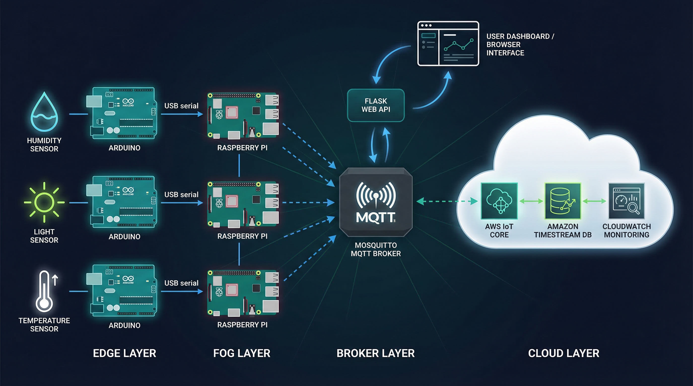

# IoT Garden

A multi-tier smart garden monitoring and control system built with Arduino, Raspberry Pi, MQTT, and AWS.




## Architecture

The system is organized into four tiers:

**Edge Layer**: Arduino microcontrollers read environmental sensors (humidity via DHT11, light via photoresistor, temperature via DHT11) and control actuators (water pump, grow light, fan) based on configurable thresholds.

**Fog Layer**: Raspberry Pi nodes act as intermediaries. Each Pi runs a Python service that reads sensor data over USB serial, publishes JSON telemetry to the local MQTT broker, and subscribes to actuator topics to forward threshold updates back to the Arduino.

**Broker Layer**: A Mosquitto MQTT broker on the management Pi handles local pub/sub and bridges sensor topics to AWS IoT Core over TLS with X.509 client certificate authentication.

**Cloud Layer**: AWS IoT Core receives bridged telemetry and routes it via IoT Rules to Amazon Timestream for time-series storage and CloudWatch for logging and alerting.

A Flask web API serves a threshold control UI and publishes actuator commands to the local broker.

## Features

- Real-time sensor monitoring (humidity, light, temperature)
- Web-based actuator threshold control via Flask UI
- Thread-safe serial communication between Pi and Arduino
- MQTT pub/sub with QoS 1 for reliable telemetry delivery
- TLS-secured bridge from local Mosquitto to AWS IoT Core
- Time-series storage in Amazon Timestream
- CloudWatch logging and alerting
- Systemd-ready services for headless deployment

## MQTT Topic Structure

| Topic | Direction | Purpose |
|---|---|---|
| `sensors/humidity` | Arduino > Pi > Broker > AWS | Humidity telemetry |
| `sensors/light` | Arduino > Pi > Broker > AWS | Light level telemetry |
| `sensors/temperature` | Arduino > Pi > Broker > AWS | Temperature telemetry |
| `actuators/water_pump` | Web UI > Broker > Pi > Arduino | Humidity threshold control |
| `actuators/light` | Web UI > Broker > Pi > Arduino | Light threshold control |
| `actuators/fan` | Web UI > Broker > Pi > Arduino | Temperature threshold control |

## Project Structure

```
iot-garden/
├── api/
│   ├── server.py              # Flask web API and threshold UI
│   └── templates/
│       └── group.html         # Dashboard template
├── fog/
│   ├── rpi_master_humidity.py # Humidity fog service (management Pi)
│   ├── rpi_slave_light.py     # Light fog service
│   └── rpi_slave_temp.py      # Temperature fog service
├── edge/
│   └── arduino_devices/
│       ├── Humidity_Arduino_Sketch.ino
│       ├── Light_Arduino_Sketch.ino
│       └── Temperature_Arduino_Sketch.ino
├── docs/
│   └── architecture.md        # Full architecture and operations guide
├── mosquitto.conf             # Broker config with AWS IoT bridge
├── .env.example               # Environment variable template
├── requirements.txt           # Python dependencies
└── start.py                   # Launch helper
```

## Prerequisites

### Hardware
- 1x Raspberry Pi (management node, runs broker, web API, and humidity service)
- 2x Raspberry Pi (fog nodes, light and temperature services)
- 3x Arduino (with DHT11 sensors and/or photoresistors)
- USB cables for serial connections

### Software
- Raspberry Pi OS (Debian-based)
- Python 3.x
- Mosquitto MQTT broker
- AWS CLI (configured with IoT permissions)
- Arduino IDE (for flashing sketches)

## Getting Started

1. **AWS IoT Setup**: Create a Thing named `bridge`, generate certificates, and attach a policy allowing publish on `sensors/#`. Download the cert, private key, and Amazon Root CA.

2. **Configure Mosquitto**: Copy `mosquitto.conf` and update the AWS endpoint and certificate paths to match your environment.

3. **Environment**: Copy `.env.example` to `.env` and fill in your serial ports, broker IP, and AWS paths.

4. **Install dependencies**
   ```bash
   pip install -r requirements.txt
   ```

5. **Flash Arduinos**: Upload the appropriate sketch to each Arduino using the Arduino IDE.

6. **Run**
   ```bash
   # Start the broker
   mosquitto -c mosquitto.conf -v

   # Start the web API
   python api/server.py

   # Start fog services (one per Pi)
   python fog/rpi_master_humidity.py
   python fog/rpi_slave_light.py
   python fog/rpi_slave_temp.py
   ```

For full deployment details including systemd units, TLS setup, Timestream configuration, and troubleshooting, see [docs/architecture.md](docs/architecture.md).

## License

This project is licensed under the MIT License. See [LICENSE](LICENSE) for details.
