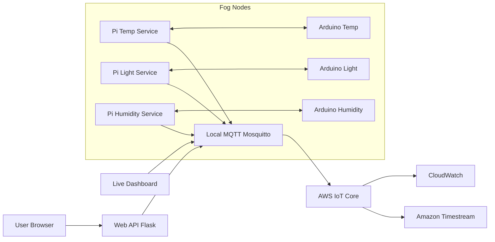
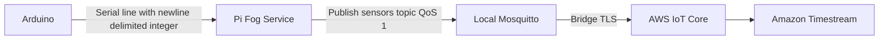
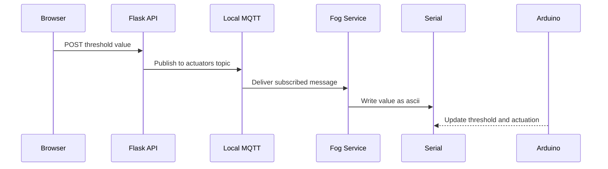
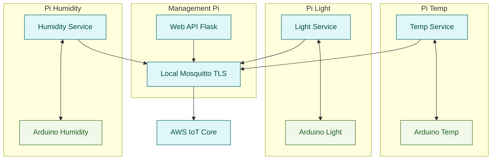

# IoT Garden Architecture and Design v1.0

Revision: 1.0
Scope profile: Raspberry Pi OS deploy for three fog nodes, each with one Arduino, central local Mosquitto broker bridged to AWS IoT Core with Timestream sink and CloudWatch logging, secured local MQTT, live dashboard.

Summary
- Purpose: Document the existing system and provide a reproducible architecture with improvements and extensions.
- Layers: Edge Arduino devices, Fog Pi nodes, Local MQTT broker and Web API, Cloud ingestion and analytics.
- Key technologies: Arduino, Python 3, Flask, Paho MQTT, Mosquitto, AWS IoT Core, Amazon Timestream, CloudWatch.

Repository component map
- Web API and UI: [api/server.py](api/server.py), [api/templates/group.html](api/templates/group.html)
- Fog services: [fog/rpi_master_humidity.py](fog/rpi_master_humidity.py), [fog/rpi_slave_light.py](fog/rpi_slave_light.py), [fog/rpi_slave_temp.py](fog/rpi_slave_temp.py)
- Arduino sketches: [edge/arduino_devices/Humidity_Arduino_Sketch.ino](edge/arduino_devices/Humidity_Arduino_Sketch.ino), [edge/arduino_devices/Light_Arduino_Sketch.ino](edge/arduino_devices/Light_Arduino_Sketch.ino), [edge/arduino_devices/Temperature_Arduino_Sketch.ino](edge/arduino_devices/Temperature_Arduino_Sketch.ino)
- Local broker bridge: [mosquitto.conf](mosquitto.conf)
- Runtime config: [.env](.env), [requirements.txt](requirements.txt)

System context


Component responsibilities
- Web API Flask
  - Serves threshold UI and publishes actuator updates to MQTT.
  - Key code: [def home()](api/server.py:20), [def tempapi()](api/server.py:26), [def lightapi()](api/server.py:34), [def humidityapi()](api/server.py:42), [def main()](api/server.py:51)
- Fog services on Pis
  - Read sensor values over serial from Arduino, publish JSON to sensors topics, subscribe to actuators topics to forward threshold values back to Arduino.
  - Temperature: [def local_mqtt_t()](fog/rpi_slave_temp.py:19), [def read_data_t()](fog/rpi_slave_temp.py:28), [def change_water_pump_threshold()](fog/rpi_slave_temp.py:44), [def main()](fog/rpi_slave_temp.py:49)
  - Light: [def local_mqtt_t()](fog/rpi_slave_light.py:19), [def read_data_t()](fog/rpi_slave_light.py:28), [def change_water_pump_threshold()](fog/rpi_slave_light.py:43), [def main()](fog/rpi_slave_light.py:47)
  - Humidity: [def local_mqtt_t()](fog/rpi_master_humidity.py:19), [def read_data_t()](fog/rpi_master_humidity.py:28), [def change_water_pump_threshold()](fog/rpi_master_humidity.py:44), [def main()](fog/rpi_master_humidity.py:49)
- Arduino firmware
  - Periodically read sensors, write readings to serial, apply actuator threshold locally to control pin 9.
  - Key functions: [void setup()](edge/arduino_devices/Humidity_Arduino_Sketch.ino:18), [void loop()](edge/arduino_devices/Humidity_Arduino_Sketch.ino:24), [void sensorRead()](edge/arduino_devices/Humidity_Arduino_Sketch.ino:43), [void thresholdSet(int readData)](edge/arduino_devices/Humidity_Arduino_Sketch.ino:94)
- Local broker and bridge
  - Mosquitto accepts local MQTT clients and bridges selected sensors topics to AWS IoT Core over TLS client certs. See [mosquitto.conf](mosquitto.conf)
- Cloud
  - AWS IoT Core receives sensors topics, routes to Timestream and CloudWatch via rules.

Key runtime dataflows
Telemetry path


Threshold control path


Deployment topology


MQTT topic taxonomy
Current topics
- sensors/temperature
- sensors/light
- sensors/humidity
- actuators/fan
- actuators/light
- actuators/water_pump

Current payloads from fog services
- sensors/temperature: {"sensor":"temperature","tempc":"NN"} where NN is ascii digits as read with newline stripped
- sensors/light: {"sensor":"light","lightl":"NN"}
- sensors/humidity: {"sensor":"humidity","humidityp":"NN"}

Proposed payload schema v1
- Topic: sensors or actuators namespace
- Envelope fields
  - ts: Unix epoch milliseconds
  - src: source identifier such as pi_temp or pi_light or pi_humidity
  - type: temperature or light or humidity
  - value: numeric reading as number
  - unit: C or ohm or percent
  - version: 1

Example telemetry JSON
```json
{
  "ts": 1710000000000,
  "src": "pi_temp",
  "type": "temperature",
  "value": 27.5,
  "unit": "C",
  "version": 1
}
```

Example actuator command JSON
```json
{
  "ts": 1710000000000,
  "src": "web_api",
  "device": "fan",
  "type": "temperature",
  "threshold": 30,
  "unit": "C",
  "version": 1
}
```

Interfaces
HTTP API
- POST /tempapi form field temp integer
- POST /lightapi form field light integer
- POST /humidityapi form field humidity integer
- Implementations: [def tempapi()](api/server.py:26), [def lightapi()](api/server.py:34), [def humidityapi()](api/server.py:42)

MQTT
- Broker: Local Mosquitto on Management Pi, TLS on port 8883 for clients, bridge to AWS IoT Core on 8883
- Fog clients connect with username and password to local broker
- QoS: 1 for sensors topics, 0 or 1 for actuators topics

Serial protocol
- Arduino emits newline terminated ascii integers at approximately 10 second intervals from [void loop()](edge/arduino_devices/Humidity_Arduino_Sketch.ino:24) via [void sensorRead()](edge/arduino_devices/Humidity_Arduino_Sketch.ino:43)
- Fog service writes ascii integer thresholds to serial from [def change_water_pump_threshold()](fog/rpi_slave_temp.py:44), [def change_water_pump_threshold()](fog/rpi_slave_light.py:43), [def change_water_pump_threshold()](fog/rpi_master_humidity.py:44)

Deployment and configuration
Host roles
- Management Pi
  - Runs local Mosquitto broker with TLS and password file
  - Runs Flask Web API for threshold UI and dashboard
  - Bridges sensors topics to AWS IoT Core
- Pi Temp, Pi Light, Pi Humidity
  - Run corresponding fog service
  - Connect to Management Pi broker on TLS port 8883

Network and ports
- Flask HTTP: 3000 tcp
- Mosquitto local TLS: 8883 tcp
- AWS IoT Core: 8883 tcp outbound
- Optional dashboard WebSocket: 3001 tcp

Environment configuration
- Each fog service uses [.env](.env) keys ARD_TEMP_PORT or ARD_LIGHT_PORT or ARD_HUMIDITY_PORT, SERIAL_BAUD_RATE, LOCAL_INTERFACE_IP set to the Management Pi address
- Web API uses LOCAL_INTERFACE_IP to point to Management Pi broker

Mosquitto TLS and bridge configuration outline
- Create a local CA and server cert for Management Pi or use an internal PKI
- Generate password file with mosquitto_passwd and reference it in mosquitto.conf
- Bridge to AWS IoT Core using the bridge client certificate, private key, and Amazon Root CA

Example mosquitto.conf snippets
```conf
listener 8883 0.0.0.0
cafile /etc/mosquitto/certs/local_ca.crt
certfile /etc/mosquitto/certs/server.crt
keyfile /etc/mosquitto/certs/server.key
allow_anonymous false
password_file /etc/mosquitto/passwd

connection awsiot
address your_endpoint-ats.iot.region.amazonaws.com:8883
topic sensors/# out 1
bridge_protocol_version mqttv311
bridge_cafile /etc/mosquitto/certs/AmazonRootCA1.pem
bridge_certfile /etc/mosquitto/certs/bridge.cert.pem
bridge_keyfile /etc/mosquitto/certs/bridge.private.key
```

AWS IoT and Timestream
IoT resources
- Thing: bridge, X509 cert and private key
- Policy attached to allow connect as clientid bridge, publish sensors topics, subscribe none
- IoT rule sensors_to_timestream to write to Timestream

Example IoT SQL
```sql
SELECT
  type as measure_name,
  value as measure_value::double,
  ts as time,
  src as src,
  topic() as topic
FROM
  'sensors/+'
```

Timestream schema
- Database: iot_garden
- Table: telemetry
- Dimensions: src, topic
- Measure name: type
- Measure value: double
- Retention: memory store 7 days, magnetic store 395 days

CloudWatch logging and metrics
- Install CloudWatch Agent on Management Pi and fog Pis
- Ship logs for Mosquitto and Python services to CloudWatch Logs groups
- Consider custom metrics for message rates and error counts using CloudWatch agent statsd or embedded PutMetric
- Alarms on no telemetry, elevated error rate, bridge disconnect

Security model
- Local MQTT requires TLS and user auth, least privilege per fog node with topic ACLs
- Flask UI behind basic auth or OAuth proxy, CSRF enabled, input validation on endpoints [def tempapi()](api/server.py:26), [def lightapi()](api/server.py:34), [def humidityapi()](api/server.py:42)
- Secrets and certificates stored on disk with 600 permissions, not in repo
- AWS IoT policy restricts publish to sensors namespace and connect on clientid bridge only

Operations runbook
Provisioning
- Flash Raspberry Pi OS Lite, set hostname per role
- Install packages: python3 python3-pip mosquitto mosquitto-clients
- Create app user and directories for certs and logs
- pip install -r [requirements.txt](requirements.txt)

Management Pi setup
- Create TLS keys for broker, configure mosquitto with TLS and password file
- Configure AWS IoT bridge as in [mosquitto.conf](mosquitto.conf)
- Start mosquitto and verify listener and bridge connectivity
- Run Flask server [def main()](api/server.py:51) on boot via systemd

Fog nodes setup
- Connect Arduino over USB, identify serial port
- Set [.env](.env) variables for port and broker ip
- Enable service on boot via systemd running the selected module

Health checks
- mosquitto_sub on sensors topics to validate telemetry
- POST Web API endpoints to validate actuator path
- Confirm Timestream table receives rows via AWS console or query

Troubleshooting
- Serial read errors or None values in [def read_data_t()](fog/rpi_slave_temp.py:28), [def read_data_t()](fog/rpi_slave_light.py:28), [def read_data_t()](fog/rpi_master_humidity.py:28) indicate port or baud mismatch
- Bridge rc errors in mosquitto logs indicate TLS or policy issues
- If actuator writes fail, confirm fog subscribed topics and serial locks

Live dashboard design
- Minimal pages
  - Overview with latest telemetry for three sensors, thresholds and actuator states
  - History chart with last 24 hours from Timestream
- Transport
  - Subscribe to sensors topics via WebSocket to local Mosquitto using mqtt over wss
- Authentication
  - Reuse UI auth or reverse proxy with OAuth

Known issues in current code and remediation plan
- Inconsistent topic use in humidity fog publish, hardcoded sensors/humidity, align to env var
- Serial lock missing in light fog write, add lock
- Payloads include newline and string valued numbers, strip and convert to numeric
- Arduino humidity sketch sets isTemp true, set false on humidity sketch
- Requirements file encoding artifacts, re save UTF 8 and pin versions
- Mixed Windows and Linux paths in [.env](.env) and [mosquitto.conf](mosquitto.conf), standardize per target
- README path errors for fog script, correct to [fog/rpi_master_humidity.py](fog/rpi_master_humidity.py)

Roadmap and extensions
- Containerize components with docker compose for dev and for arm64
- Schema versioning for telemetry and actuator messages
- Add metrics exporter and dashboards
- Add device shadow in cloud to store thresholds

Appendix A systemd services
Fog service unit example
```ini
[Unit]
Description=IoT Garden Fog Service Temp
After=network.target mosquitto.service

[Service]
EnvironmentFile=/opt/iot-garden/.env
ExecStart=/usr/bin/python3 /opt/iot-garden/fog/rpi_slave_temp.py
WorkingDirectory=/opt/iot-garden
Restart=always
User=iot

[Install]
WantedBy=multi-user.target
```

Flask API unit example
```ini
[Unit]
Description=IoT Garden Web API
After=network.target

[Service]
EnvironmentFile=/opt/iot-garden/.env
ExecStart=/usr/bin/python3 /opt/iot-garden/api/server.py
WorkingDirectory=/opt/iot-garden
Restart=always
User=iot

[Install]
WantedBy=multi-user.target
```

Appendix B example .env for fog nodes
```env
LOCAL_INTERFACE_IP=192.168.1.10
SERIAL_BAUD_RATE=9600
ARD_TEMP_SENSOR_TOPIC=sensors/temperature
ARD_TEMP_ACTUATOR_TOPIC=actuators/fan
ARD_TEMP_PORT=/dev/ttyACM0
```

Appendix C topic ACL example for local broker
```conf
pattern readwrite sensors/temperature
pattern readwrite sensors/light
pattern readwrite sensors/humidity
user fog_temp
topic readwrite sensors/temperature
user fog_light
topic readwrite sensors/light
user fog_humidity
topic readwrite sensors/humidity
```

End of document